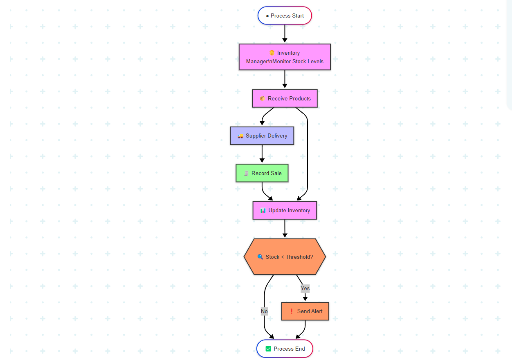
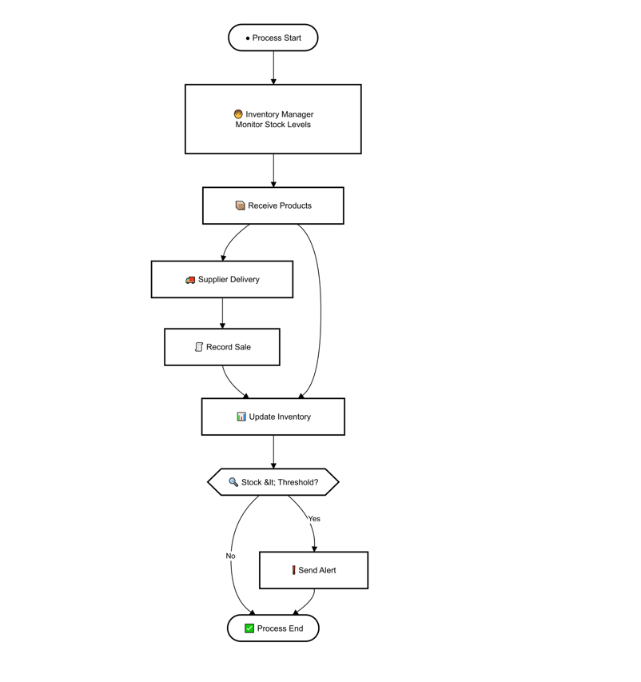
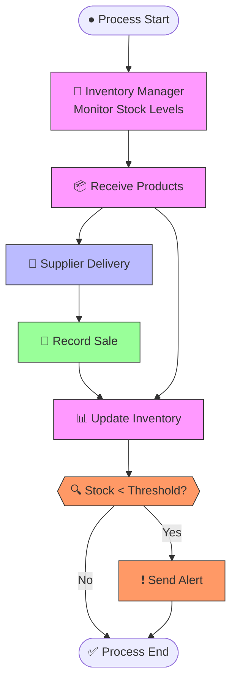

# 🎓 PL/SQL FINAL EXAM

## 👤 Identification
- **Name:** Habimana Cedrick  
- **Student ID:** 27443  
- **Project Title:** Small Retail Inventory System  
- **Course:** INSY 8311 - Database Development with PL/SQL  
- **Academic Year:** 2024-2025  
- **Lecturer:** Eric Maniraguha (eric.maniraguha@auca.ac.rw)  

---

## 🚀 Phase I: Problem Statement & Presentation

### 📌 Objective
To identify a real-world issue that requires a **PL/SQL-based Oracle database solution**. The system must involve multiple entities and complex logic suitable for database development and procedural programming.

---

## 💡 Project Summary: Small Retail Inventory System

### 📖 Problem Definition
Small retail stores often struggle with manual inventory tracking. This leads to:
- Overstocking or stockouts
- Inefficiency in restocking
- Inaccurate sales reporting

### 🌍 Context
The system will be deployed in:
- Small grocery stores
- Corner shops
- Local retail stores

It will help automate the management of product stock, sales tracking, and supplier coordination.

### 🎯 Target Users
- Small retail store owners
- Cashiers and shop managers

### 🏆 Project Goals
- 🛒 Automate inventory tracking  
- 📊 Monitor real-time stock levels and sales  
- 🔔 Alert users for low stock  
- 📦 Track suppliers and streamline restocking  
- 📈 Improve overall business operation accuracy  

---

## 🧩 Key Database Entities

| Entity             | Attributes                                                                 |
|--------------------|----------------------------------------------------------------------------|
| **Products**        | `Product_ID`, `Name`, `Price`, `Quantity`                              |
| **Sales**           | `Sale_ID`, `Product_ID`, `Date`, `Quantity_Sold`                           |
| **Suppliers**       | `Supplier_ID`, `Name`, `Contact`, `Created_At`                       |
| **Supplier_Product**| `Supplier_ID`, `Product_ID`, `Supply_Date`                                 |

### 🔗 Relationships
- A **Supplier** can supply **many Products** (1:N)  
- A **Product** can be involved in **many Sales** (1:N)  

---

## 💎 System Benefits
✅ Reduces human errors in stock counting  
✅ Sends low stock alerts automatically  
✅ Tracks supplier-product links for easy replenishment  
✅ Enhances record accuracy with real-time sales logging  
✅ Improves decision-making with reliable inventory data  

🖼️ Screenshot Placeholder

---

## 📘 Phase II: Business Process Modeling (MIS)

### 🔍 Scope & Purpose
This phase models the **inventory workflow** from stock monitoring to sales and low-stock alerting. It demonstrates how an **MIS supports decision-making** through automation and accurate data flow.

### 👥 Key Actors

| Role               | Responsibility                             |
|--------------------|---------------------------------------------|
| Inventory Manager  | Monitors stock and updates inventory        |
| Supplier           | Delivers products                           |
| Sales Clerk        | Records sales                               |
| Inventory System   | Maintains stock data, evaluates thresholds  |
| Alert System       | Notifies when stock is low                  |

---

### 🖼️ Process Diagram

✅ **Tools Used:**  
- **Mermaid** (Lightweight Markdown-based modeling)  
- **Draw.io** (Standard BPMN format)  

#### 🔗 Mermaid Diagram  

 

#### 🧩 Draw.io BPMN Diagram  

---

### 🧠 MIS Value & Flow Summary
The diagram starts with the **Inventory Manager** monitoring stock. When a product is low, they receive deliveries from the **Supplier**. The system is then updated. When a **Sales Clerk** records a sale, the inventory is updated again. After each update, the **Inventory System** evaluates whether the stock has fallen below the set threshold. If so, the **Alert System** automatically notifies the manager for restocking.  

This workflow supports MIS by:
- Enabling **real-time decision-making**  
- Reducing **manual effort** through automation  
- **Improving efficiency** in retail operations  

---

### 💻 Mermaid Code Reference

---

## 🧩 Phase III: Logical Model Design

### 🎯 Objective

This project addresses the inventory challenges of small retail stores, including overstocking, stockouts, and poor supplier coordination. The logical model developed in this phase is based on the real-world needs outlined in Phase I and the process workflow modeled in Phase II.

To design a normalized, well-constrained, and relational data model that accurately represents the inventory, sales, and supplier interactions of a small retail business.

---

### 🗃️ Entities & Attributes

#### 📦 Products

| Attribute    | Type         | Constraint                      |
|--------------|--------------|----------------------------------|
| Product_ID   | NUMBER       | Primary Key (Auto-generated)     |
| Name         | VARCHAR(100) | NOT NULL                         |
| Price        | NUMBER(10,2) | NOT NULL, CHECK (Price > 0)      |
| Quantity     | NUMBER       | DEFAULT 0, CHECK (Quantity ≥ 0)  |
| Created_At   | DATE         | DEFAULT SYSDATE                  |

#### 🧾 Sales

| Attribute      | Type       | Constraint                          |
|----------------|------------|-------------------------------------|
| Sale_ID        | NUMBER     | Primary Key (Auto-generated)        |
| Product_ID     | NUMBER     | Foreign Key → Products              |
| Quantity_Sold  | NUMBER     | NOT NULL, CHECK (Quantity_Sold > 0) |
| Sale_Date      | DATE       | DEFAULT SYSDATE                     |

#### 🚚 Suppliers

| Attribute     | Type         | Constraint                       |
|---------------|--------------|----------------------------------|
| Supplier_ID   | NUMBER       | Primary Key (Auto-generated)     |
| Name          | VARCHAR(100) | NOT NULL                         |
| Contact       | VARCHAR(100) | UNIQUE, NOT NULL                 |
| Created_At    | DATE         | DEFAULT SYSDATE                  |

#### 🔗 Supplier_Product (Junction Table)

| Attribute     | Type    | Constraint                             |
|---------------|---------|----------------------------------------|
| Supplier_ID   | NUMBER  | Foreign Key → Suppliers, part of PK     |
| Product_ID    | NUMBER  | Foreign Key → Products, part of PK      |
| Supply_Date   | DATE    | DEFAULT SYSDATE                         |

---

### 🔄 Relationships & Constraints

- 🧩 **Suppliers ↔ Products** — *Many-to-Many* via `Supplier_Product`  
- 📈 **Products → Sales** — *One-to-Many*  
- ✅ Foreign keys ensure data integrity  
- ✅ CHECK constraints enforce data validity  
- ✅ DEFAULT and UNIQUE improve usability and data quality  

---

### 📐 Normalization (3NF Verified)

- ✅ **1NF** – Atomic values only  
- ✅ **2NF** – All attributes fully dependent on PKs  
- ✅ **3NF** – No transitive dependencies  

---

### 🧪 Real-World Scenario Coverage

| Scenario                                         | Supported |
|--------------------------------------------------|-----------|
| Track products with current stock levels         | ✅        |
| Record every sale tied to a product              | ✅        |
| Handle suppliers offering multiple products      | ✅        |
| Prevent invalid sales (e.g., nonexistent product)| ✅        |
| Ensure valid pricing and quantities              | ✅        |
| Avoid duplicate supplier contact info            | ✅        |

---

### 🖼️ ERD Diagram

> 🟩 **Visual Placeholder: Logical Model ERD**  
> 👉 *This image illustrates the tables, keys, and relationships defined above via Mermaid chart and also SQL developer.*

 

---

### 💻 SQL Script Location

> 📁 [`/sql/create_logical_model.sql`](./sql/create_logical_model.sql)  
> Contains complete code for all table creation, constraints, and relationships.

---

