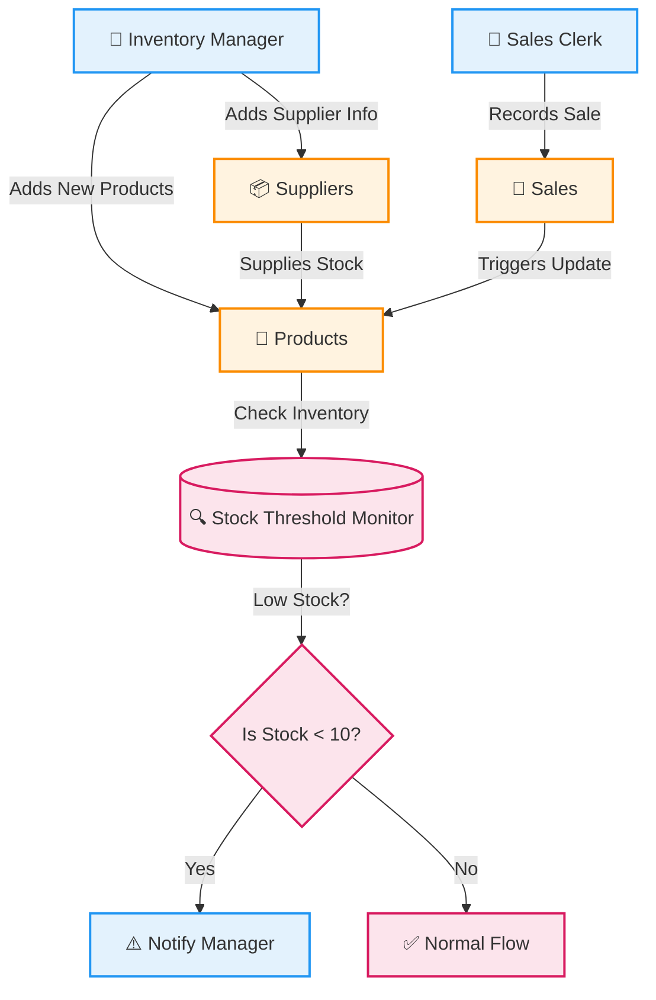
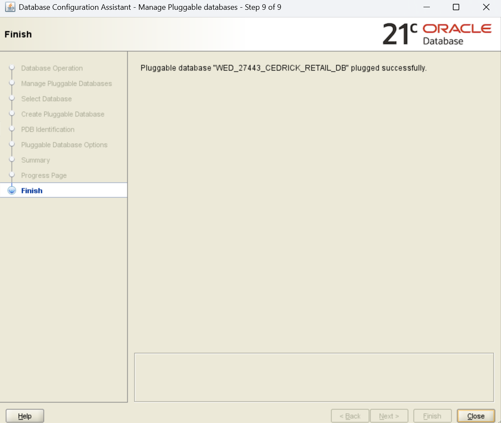
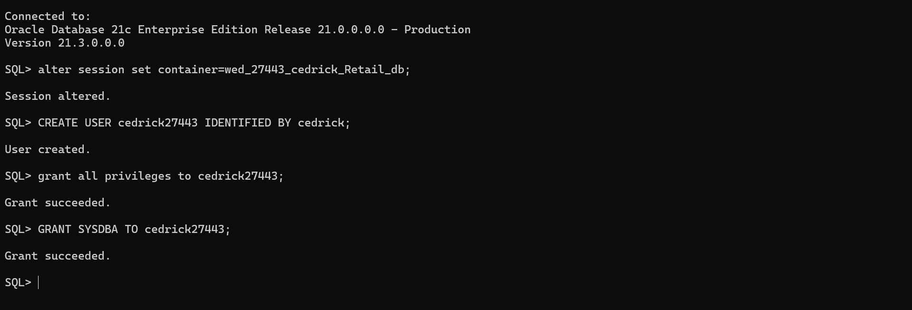
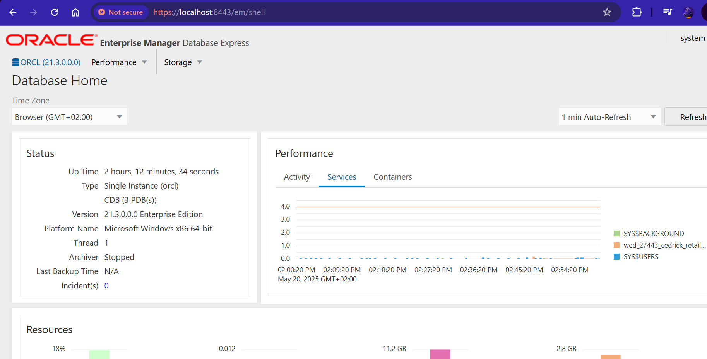
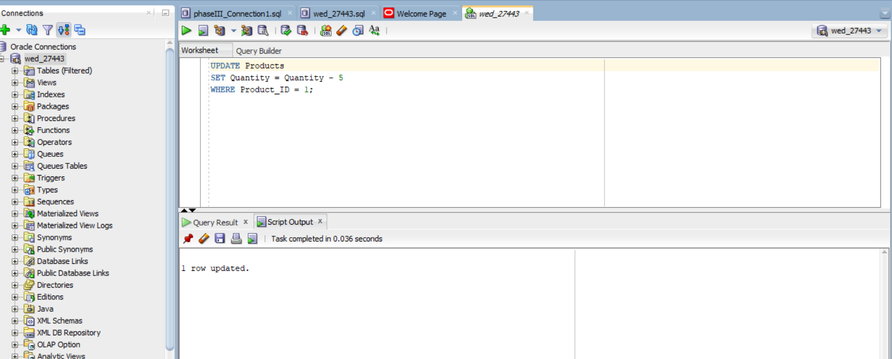
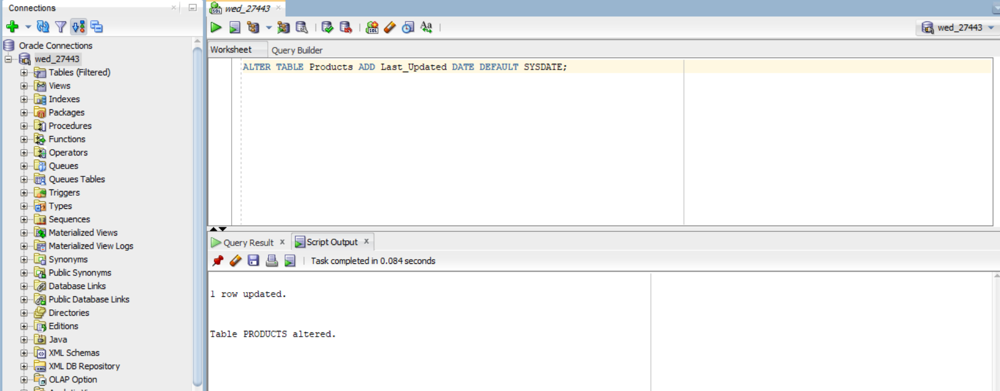
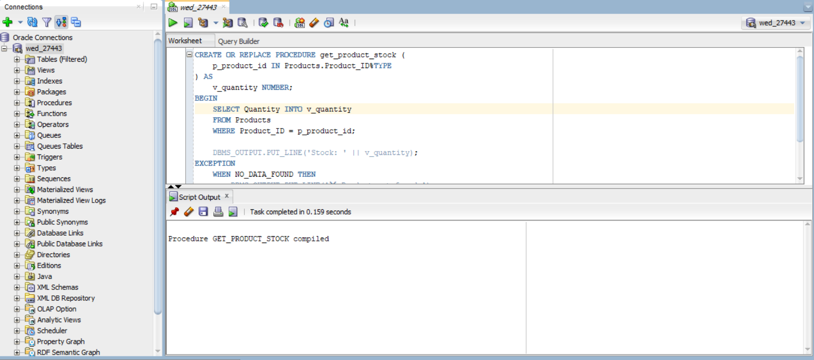
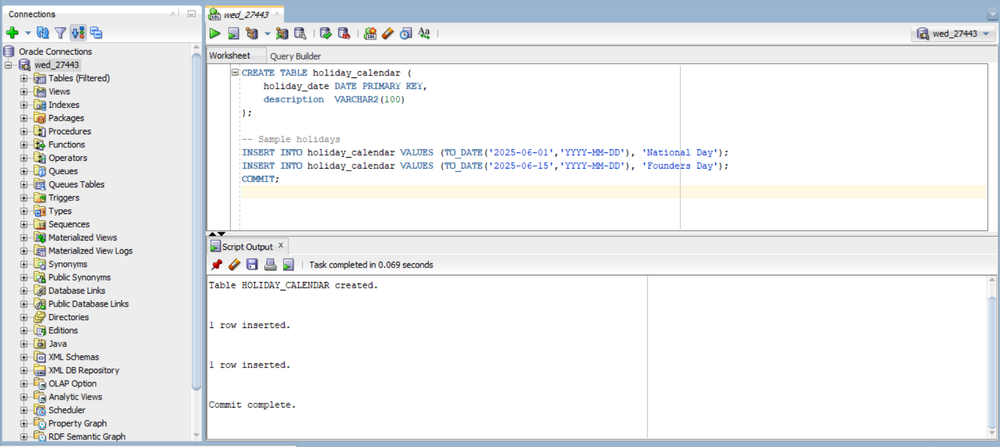

# 🎓 PL/SQL FINAL EXAM

## 👤 Identification
- **Name:** Habimana Cedrick  
- **Student ID:** 27443  
- **Project Title:** Small Retail Inventory System  
- **Course:** INSY 8311 - Database Development with PL/SQL  
- **Academic Year:** 2024-2025  
- **Lecturer:** Eric Maniraguha (eric.maniraguha@auca.ac.rw)  

---

## 🚀 Phase I: Problem Statement & Presentation

### 📌 Objective
To identify a real-world issue that requires a **PL/SQL-based Oracle database solution**. The system must involve multiple entities and complex logic suitable for database development and procedural programming.

---

## 💡 Project Summary: Small Retail Inventory System

### 📖 Problem Definition
Small retail stores often struggle with manual inventory tracking. This leads to:
- Overstocking or stockouts
- Inefficiency in restocking
- Inaccurate sales reporting

### 🌍 Context
The system will be deployed in:
- Small grocery stores
- Corner shops
- Local retail stores

It will help automate the management of product stock, sales tracking, and supplier coordination.

### 🎯 Target Users
- Small retail store owners
- Cashiers and shop managers

### 🏆 Project Goals
- 🛒 Automate inventory tracking  
- 📊 Monitor real-time stock levels and sales  
- 🔔 Alert users for low stock  
- 📦 Track suppliers and streamline restocking  
- 📈 Improve overall business operation accuracy  

---

## 🧩 Key Database Entities

| Entity             | Attributes                                                                 |
|--------------------|----------------------------------------------------------------------------|
| **Products**        | `Product_ID`, `Name`, `Price`, `Quantity`                              |
| **Sales**           | `Sale_ID`, `Product_ID`, `Date`, `Quantity_Sold`                           |
| **Suppliers**       | `Supplier_ID`, `Name`, `Contact`, `Created_At`                       |
| **Supplier_Product**| `Supplier_ID`, `Product_ID`, `Supply_Date`                                 |

### 🔗 Relationships
- A **Supplier** can supply **many Products** (M:N)  
- A **Product** can be involved in **many Sales** (1:N)  

---

## 💎 System Benefits
✅ Reduces human errors in stock counting  
✅ Sends low stock alerts automatically  
✅ Tracks supplier-product links for easy replenishment  
✅ Enhances record accuracy with real-time sales logging  
✅ Improves decision-making with reliable inventory data  

---



---


---
---

## 📘 Phase II: Business Process Modeling (MIS)

### 🔍 Scope & Purpose
This phase models the **inventory workflow** from stock monitoring to sales and low-stock alerting. It demonstrates how an **MIS supports decision-making** through automation and accurate data flow.

### 👥 Key Actors

| Role               | Responsibility                             |
|--------------------|---------------------------------------------|
| Inventory Manager  | Monitors stock and updates inventory        |
| Supplier           | Delivers products                           |
| Sales Clerk        | Records sales                               |
| Inventory System   | Maintains stock data, evaluates thresholds  |
| Alert System       | Notifies when stock is low                  |

---

### 🖼️ Process Diagram

✅ **Tools Used:**  
- **Mermaid** (Lightweight Markdown-based modeling)  
- **Draw.io** (Standard BPMN format)  

#### 🔗 Mermaid Diagram  


<br>

#### 🧩 Draw.io BPMN Diagram  


---

### 🧠 MIS Value & Flow Summary
The diagram starts with the **Inventory Manager** monitoring stock. When a product is low, they receive deliveries from the **Supplier**. The system is then updated. When a **Sales Clerk** records a sale, the inventory is updated again. After each update, the **Inventory System** evaluates whether the stock has fallen below the set threshold. If so, the **Alert System** automatically notifies the manager for restocking.  

This workflow supports MIS by:
- Enabling **real-time decision-making**  
- Reducing **manual effort** through automation  
- **Improving efficiency** in retail operations  

---

### 💻 Mermaid Code Reference


---

## 🧩 Phase III: Logical Model Design

### 🎯 Objective

This project addresses the inventory challenges of small retail stores, including overstocking, stockouts, and poor supplier coordination. The logical model developed in this phase is based on the real-world needs outlined in Phase I and the process workflow modeled in Phase II.

To design a normalized, well-constrained, and relational data model that accurately represents the inventory, sales, and supplier interactions of a small retail business.

---

### 🗃️ Entities & Attributes

#### 📦 Products

| Attribute    | Type         | Constraint                      |
|--------------|--------------|----------------------------------|
| Product_ID   | NUMBER       | Primary Key (Auto-generated)     |
| Name         | VARCHAR(100) | NOT NULL                         |
| Price        | NUMBER(10,2) | NOT NULL, CHECK (Price > 0)      |
| Quantity     | NUMBER       | DEFAULT 0, CHECK (Quantity ≥ 0)  |
| Created_At   | DATE         | DEFAULT SYSDATE                  |

#### 🧾 Sales

| Attribute      | Type       | Constraint                          |
|----------------|------------|-------------------------------------|
| Sale_ID        | NUMBER     | Primary Key (Auto-generated)        |
| Product_ID     | NUMBER     | Foreign Key → Products              |
| Quantity_Sold  | NUMBER     | NOT NULL, CHECK (Quantity_Sold > 0) |
| Sale_Date      | DATE       | DEFAULT SYSDATE                     |

#### 🚚 Suppliers

| Attribute     | Type         | Constraint                       |
|---------------|--------------|----------------------------------|
| Supplier_ID   | NUMBER       | Primary Key (Auto-generated)     |
| Name          | VARCHAR(100) | NOT NULL                         |
| Contact       | VARCHAR(100) | UNIQUE, NOT NULL                 |
| Created_At    | DATE         | DEFAULT SYSDATE                  |

#### 🔗 Supplier_Product (Junction Table)

| Attribute     | Type    | Constraint                             |
|---------------|---------|----------------------------------------|
| Supplier_ID   | NUMBER  | Foreign Key → Suppliers, part of PK     |
| Product_ID    | NUMBER  | Foreign Key → Products, part of PK      |
| Supply_Date   | DATE    | DEFAULT SYSDATE                         |

---

### 🔄 Relationships & Constraints

- 🧩 **Suppliers ↔ Products** — *Many-to-Many* via `Supplier_Product`  
- 📈 **Products → Sales** — *One-to-Many* 
- ✅ Foreign keys ensure data integrity  
- ✅ CHECK constraints enforce data validity  
- ✅ DEFAULT and UNIQUE improve usability and data quality  

---

### 📐 Normalization (3NF Verified)

- ✅ **1NF** – Atomic values only  
- ✅ **2NF** – All attributes fully dependent on PKs  
- ✅ **3NF** – No transitive dependencies  

---

### 🧪 Real-World Scenario Coverage

| Scenario                                         | Supported |
|--------------------------------------------------|-----------|
| Track products with current stock levels         | ✅        |
| Record every sale tied to a product              | ✅        |
| Handle suppliers offering multiple products      | ✅        |
| Prevent invalid sales (e.g., nonexistent product)| ✅        |
| Ensure valid pricing and quantities              | ✅        |
| Avoid duplicate supplier contact info            | ✅        |

---

### 🖼️ ERD Diagram

> 🟩 **Visual Placeholder: Logical Model ERD**  
> 👉 *This image illustrates the tables, keys, and relationships defined above via Mermaid chart and also SQL developer.*


<br>


---

### 💻 SQL Script Location

> 📁 [`/sql/create_logical_model.sql`](./sql/create_logical_model.sql)  
> Contains complete code for all table creation, constraints, and relationships.

---
---

## 🏗️ Phase IV: Database Creation and Access Setup (via SQL Developer)

### 🎯 Objective

To create a dedicated Oracle PL/SQL database environment using SQL Developer as an **alternative to Oracle Enterprise Manager (OEM)**. This setup provides full access control and prepares the development environment for Phase V.

---

### 🔐 Task 1: PDB and User Creation (SQL Developer)

The user and development environment were set up inside an Oracle **Pluggable Database (PDB)** using **SQL Developer**, which allows graphical interaction and full administrative capabilities.

---

### 🧰 Configuration Summary

| Component             | Value                                  |
|------------------------|----------------------------------------|
| **Tool Used**         | SQL Developer (OEM Alternative)         |
| **PDB Name**          | `wed_27443_cedrick_Retail_db`           |
| **User Created**      | `cedrick27443`                          |
| **Password**          | `cedrick`                               |
| **Privileges Granted**| Full DBA privileges                     |

---

### 📸 Screenshot: PDB Creation in SQL Developer



---
<br>

### 📸 Screenshot: User Created & Privileges Granted



```sql
-- SQL run inside SQL plus

alter session set container=WED_27443_Cedrick_Retail_DB;
CREATE USER cedrick27443 IDENTIFIED BY cedrick;
GRANT all privileges to cedrick27443;
GRANT SYSDBA to cedrick27443;
```
---
---
<!-- OEM Screenshot -->

---

---
<!-- OEM 1 Screenshot -->

---

---
<!-- OEM 2 Screenshot -->

---


---

---

### 📸 Screenshot: User Successfully Connected to PDB in SQL Developer


---

### ✅ Summary

| Step                             | Completed |
|----------------------------------|-----------|
| PDB created                      | ✅        |
| Project user created             | ✅        |
| Password set to first name       | ✅        |
| DBA privileges granted           | ✅        |
| SQL Developer used as OEM alt    | ✅        |
| Screenshots taken and stored     | ✅        |

---
---

## 🧱 Phase V: Table Implementation and Data Insertion

### 🎯 Objective

To implement the physical database structure based on the logical model and insert meaningful, testable data. This phase ensures structural integrity, accurate constraints, and realistic data to support business operations and future PL/SQL programming.

---

### 🔨 Step 1: Table Creation

✅ The following tables were created in the schema `WED_27443_Cedrick_Retail_DB` using SQL Developer:

---

#### 🧱 Table: Suppliers


---

#### 🧱 Table: Products


---

#### 🧱 Table: Sales


---

#### 🧱 Table: Supplier_Product


---

### 📥 Step 2: Data Insertion

Realistic data entries were inserted for each table to reflect meaningful retail operations.

---

#### 🗃️ Insertion: Suppliers


---

#### 🗃️ Insertion: Products


---

#### 🗃️ Insertion: Sales


---

#### 🗃️ Insertion: Supplier_Product

 

---

### 🔍 Step 3: Data Integrity Validation

A join query was executed to validate relationships and ensure referential integrity.

> ✅ Result confirmed that:
- All foreign keys work as expected
- Many-to-many and one-to-many relationships are intact
- Data is consistent and logically connected


---

### 🛡️ Step 4: Constraints and Integrity

| Constraint       | Applied To             | Type                  |
|------------------|------------------------|------------------------|
| `PRIMARY KEY`    | All 4 tables           | Uniquely identifies rows |
| `FOREIGN KEY`    | Sales, Supplier_Product| Enforces referential integrity |
| `NOT NULL`       | Most attributes        | Prevents null violations |
| `UNIQUE`         | Suppliers.Contact      | Prevents duplicate entries |
| `CHECK`          | Product price/quantity| Validates acceptable values |
| `DEFAULT`        | Created_At, Supply_Date| Auto-fills dates       |

---

### ✅ Summary

| Deliverable              | Status |
|---------------------------|--------|
| Physical table creation   | ✅     |
| Data inserted             | ✅     |
| Data integrity validated  | ✅     |
| Constraints applied       | ✅     |
| Screenshots added         | ✅     |

---

---

## 🔧 Phase VI: PL/SQL Programming (Procedures, Functions, Triggers, Packages)

### 🎯 Objective

To implement business logic directly within the Oracle database using PL/SQL. This includes **automating operations**, **analyzing data**, and **ensuring reliability** through procedures, functions, triggers, and packages.

---

## 🧱 Database Operations

### 🔁 DML Operations
- `INSERT`, `UPDATE`, `DELETE` queries were used to manipulate table data.
- Example: Updating product quantities, deleting old supplier entries, and inserting new sales.
---


---

### 🧩 DDL Operations
- `CREATE`, `ALTER`, and `DROP` commands were executed to structure the database.
- Example: Added new columns like `Last_Updated` and modified constraints during testing.
---


---
## 💡 Simple Analytics Problem Statement

> “Analyze how many times each product has been sold to help determine restocking priorities.”

This was implemented using a **Window Function** on the `Sales` table to track total sales per product.

```sql
SELECT 
    p.Product_Name,
    s.Product_ID,
    SUM(s.Quantity_Sold) OVER (PARTITION BY s.Product_ID) AS Total_Sold
FROM Sales s
JOIN Products p ON s.Product_ID = p.Product_ID;
```
---


---

## 🛠️ PL/SQL Components

### ✅ Procedure: `register_sale`

- Records a new sale
- Automatically decreases stock quantity
- Warns if stock is low
- Retrieved data using cursors


---


---
---


---
---
#####  !!Cursors:
-data is now retrieved because of cursors


---


## 🧪 Testing:
All PL/SQL components were **individually tested** using anonymous blocks and verified with realistic test data.

---
### ✅ Function-Quantity-Testing: `get_stock_level`

- Returns the current quantity of a specified product
- Useful for on-demand stock checks


---
### ✅ Trigger-Products-Testing:  `trigger_stock_alert`

- Fires automatically after a product’s quantity is updated
- Alerts if quantity falls below threshold


---
## 📦 PL/SQL Package: `inventory_pkg`

This package encapsulates reusable logic:
- `register_sale` procedure
- `get_stock_level` function

**Benefits:**
- Modular code structure
- Reusability and better organization
---


---
---


---
---


---


---

### ✅ Package-Testing


---

## ✅ Summary of Deliverables

| Task                           | Completed |
|--------------------------------|-----------|
| DDL / DML Commands             | ✅        |
| Simple Analytics Query         | ✅        |
| Procedure                      | ✅        |
| Function                       | ✅        |
| Cursor Use (in Procedure)      | ✅        |
| Exception Handling             | ✅        |
| Trigger                        | ✅        |
| Package with Reusable Logic    | ✅        |
| Testing + Screenshots          | ✅        |

---

---

## 🧠 Phase VII: Advanced Database Programming and Auditing

### 🎯 Objective

To secure the inventory system by implementing **trigger-based restrictions**, a **centralized audit system**, and **package-based logging** to ensure real-time monitoring, access control, and accountability for all table-level actions.

---

## 🔍 Problem Statement

Small retail databases are vulnerable to unauthorized or unintended changes during business-critical times. This project implements advanced features like:

- ❌ Preventing table changes during weekdays and holidays
- 🕵️ Tracking who tried to change what and when
- 📦 Centralizing audit logic via PL/SQL packages

This adds a layer of **governance**, **traceability**, and **control**, critical for Management Information Systems.

---

## 📅 Holiday Restriction System

### ✅ `holiday_calendar` Table

Used to store blocked dates (holidays).

```sql
CREATE TABLE holiday_calendar (
    holiday_date DATE PRIMARY KEY,
    description  VARCHAR2(100)
);

-- Sample holiday entries
INSERT INTO holiday_calendar VALUES (TO_DATE('2025-06-01','YYYY-MM-DD'), 'National Day');
INSERT INTO holiday_calendar VALUES (TO_DATE('2025-06-15','YYYY-MM-DD'), 'Founders Day');
COMMIT;
```





---

## 🧨 Trigger-Based Restriction Logic

### ✅ `trg_block_weekdays_holidays` on `Products`

Prevents DML on weekdays and public holidays.

```sql
CREATE OR REPLACE TRIGGER trg_block_weekdays_holidays
BEFORE INSERT OR UPDATE OR DELETE ON Products
FOR EACH ROW
DECLARE
    v_today     VARCHAR2(10);
    v_is_holiday NUMBER;
BEGIN
    SELECT TO_CHAR(SYSDATE, 'DY') INTO v_today FROM dual;

    SELECT COUNT(*) INTO v_is_holiday
    FROM holiday_calendar
    WHERE holiday_date = TRUNC(SYSDATE);

    IF v_today IN ('MON', 'TUE', 'WED', 'THU', 'FRI') OR v_is_holiday > 0 THEN
        RAISE_APPLICATION_ERROR(-20001, '🔒 DML blocked: Not allowed on weekdays or holidays.');
    END IF;
END;
```


---

---

## 🕵️ Auditing System

### ✅ `audit_log` Table

Captures every insert/update/delete attempt with user ID, date, and status.

```sql
CREATE TABLE audit_log (
    audit_id     NUMBER GENERATED ALWAYS AS IDENTITY PRIMARY KEY,
    user_id      VARCHAR2(30),
    action_date  DATE DEFAULT SYSDATE,
    table_name   VARCHAR2(50),
    operation    VARCHAR2(20),
    status       VARCHAR2(20),
    remarks      VARCHAR2(100)
);
```


---
## 🔄 Trigger + Audit Combined

Trigger uses the package to log **ALLOWED or DENIED** attempts.

```sql
CREATE OR REPLACE TRIGGER trg_audit_products
BEFORE INSERT OR UPDATE OR DELETE ON Products
FOR EACH ROW
DECLARE
    v_day        VARCHAR2(10);
    v_is_holiday NUMBER;
    v_status     VARCHAR2(20);
BEGIN
    SELECT TO_CHAR(SYSDATE, 'DY') INTO v_day FROM dual;
    SELECT COUNT(*) INTO v_is_holiday
    FROM holiday_calendar
    WHERE holiday_date = TRUNC(SYSDATE);

    IF v_day IN ('MON','TUE','WED','THU','FRI') OR v_is_holiday > 0 THEN
        v_status := 'DENIED';
        audit_pkg.log_action('PRODUCTS', 'BLOCKED DML', v_status, 'Blocked by weekday/holiday trigger');
        RAISE_APPLICATION_ERROR(-20002, '🚫 Action denied by policy.');
    ELSE
        v_status := 'ALLOWED';
        audit_pkg.log_action('PRODUCTS', 'DML', v_status, 'Weekend or holiday not detected.');
    END IF;
END;
```


---

## 📦 `audit_pkg` – Centralized Audit Logging Package

### ✅ Package Specification

```sql
CREATE OR REPLACE PACKAGE audit_pkg IS
  PROCEDURE log_action(
    p_table VARCHAR2,
    p_operation VARCHAR2,
    p_status VARCHAR2,
    p_remarks VARCHAR2
  );
END audit_pkg;
```

### ✅ Package Body

```sql
CREATE OR REPLACE PACKAGE BODY audit_pkg IS
  PROCEDURE log_action(
    p_table VARCHAR2,
    p_operation VARCHAR2,
    p_status VARCHAR2,
    p_remarks VARCHAR2
  ) IS
  BEGIN
    INSERT INTO audit_log (user_id, table_name, operation, status, remarks)
    VALUES (USER, p_table, p_operation, p_status, p_remarks);
  END;
END audit_pkg;
```


**OPTIONAL PACKAGE BODY AUDIT:**


---

---

## 🧪 Testing & Evidence

### 🔬 1. ✅ Manual Log Entry (Weekend)

```sql
BEGIN
  audit_pkg.log_action('PRODUCTS', 'TESTING', 'ALLOWED', 'Weekend - Manually Passed');
END;
```


---
### 🔬 2. ❌ Denied Insert (Weekday or Holiday)

```sql
INSERT INTO Products (P_Name, Price, Quantity)
VALUES ('Test Product', 19.99, 10);
```

Expected: Fails + logged as "DENIED"


---

### 🔬 3. 🔍 Viewing Audit Table

```sql
SELECT * FROM audit_log ORDER BY action_date DESC;
```


---

### 🔬 4. ❌ Denied update and delete (Weekday or Holiday)

```sql
UPDATE Products
SET Quantity = Quantity + 5
WHERE Product_ID = 1;
```
---
---

```sql
DELETE FROM Products
WHERE Product_ID = 2;
```
---


---

## ✅ Summary of Requirements Completed

| Requirement Area         | Task                                      | ✅ Status |
|--------------------------|-------------------------------------------|-----------|
| Problem Statement        | Clearly described + justified             | ✅        |
| Holiday System           | Table created + data populated            | ✅        |
| Trigger Logic            | Created for Products, Sales, Suppliers    | ✅        |
| Auditing                 | Tracked actions with DENIED/ALLOWED logic | ✅        |
| Packages                 | audit_pkg created and reused              | ✅        |
| Testing & Screenshots    | All cases run and documented              | ✅        |

---

📌 **Phase VII Complete – System Secured and Audited**


